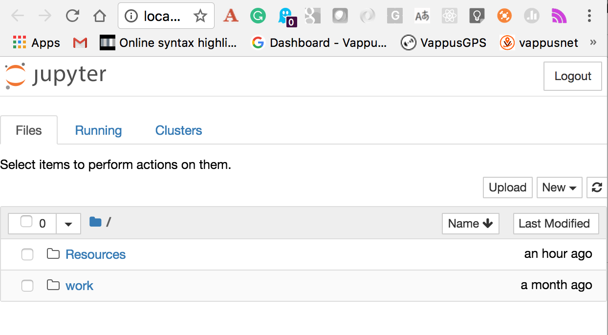
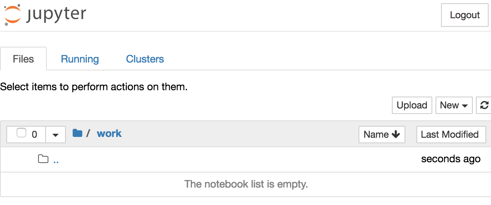
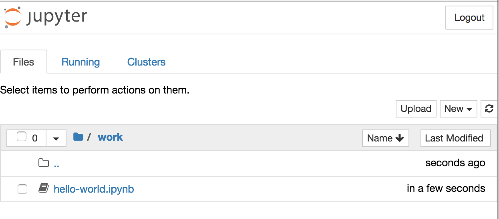
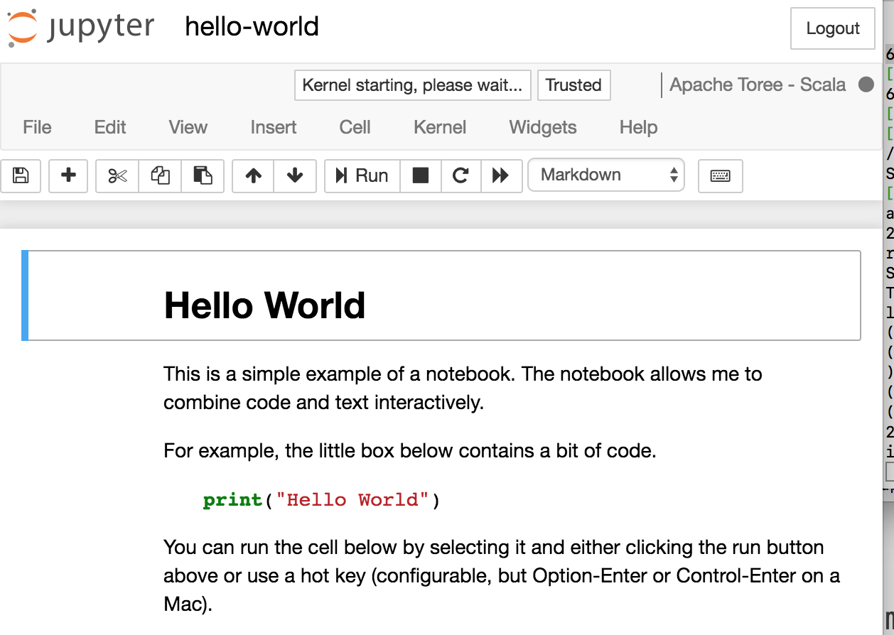

# Running Notebooks

## Introduction

Jupyter Notebooks can be used to execute Spark code.

The Jupyter Notebooks support multiple languages. Before we go on to play with the Notebooks, let's make sure we have notebooks running. We have separated out the instructions for how to run the Notebooks (as you probably have to do this multiple times during this course).

Please use these instructions to start the notebooks. When you're done, you can come back to these instructions to finish up the exercise:

> [Instructions for starting Notebooks](../../../running-notebooks.md)

### Importing Notebooks

All the notebooks live outside Notebooks but can be imported into Jupyter by a simple upload.
We suggest you import all the notebooks into the directory `Works` inside your Jupyter environment. This way, all the links to the resources in the notebooks should work without you having to modify the code.

### Hello World Example

Here is an example of how to import a notebook. You can try following along to see your first notebook (although, no Spark will be shown in this example).

We'll assume that you got Jupyter is up and running.
When you launched your browser on the correct URL, you should see something like this:

Next, you need to navigate into the `work` directory.
You do so by simply clicking on the `work` link representing the directory.

You should now see something like this:

Now click on the `upload` button.
Browse to the directory where you have expanded the course material and look inside the `notebooks` directory.

Select the `hello-world` notebook.

Next simply open the hello-world notebook. If successful you should see something like this:

Take your time going through the workbook and make sure you understand the general concepts.
