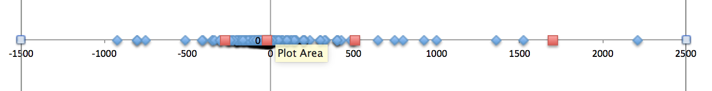
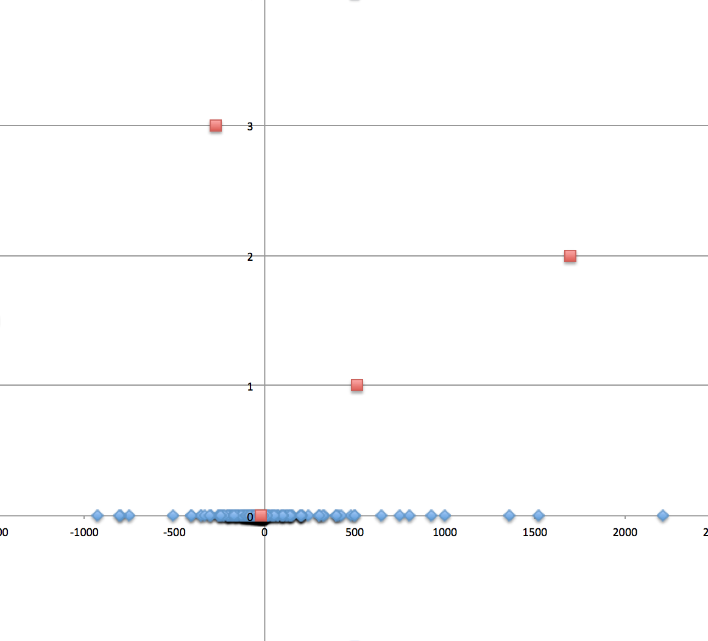

# Spark MLlib

In this lab, you will take your first steps using Spark's machine learning library, MLlib, specifically, the high-level ML pipeline API, to perform a k-means cluster analysis of transaction data.

## Objectives

1. Open and interact with Spark via Spark's interactive shell.
2. Use the ML pipeline library to produce a k-means-based model.
3. Use the generated model to predict the cluster to which given test transactions belong.

## Prerequisites

This lab assumes that the student is familiar with the course environment, in particular, the Spark distribution.

## Instructions

### Open the Spark shell

First, we need to open the Spark shell.  Simply change directory to your Spark home and issue the command  `bin/spark-shell` command:

``` sh
$ cd $SPARK_HOME
$ bin/spark-shell --master local[*]
```

Next, you'll see output like the following.  Don't worry if the versions of things shown below don't *exactly* match what you have on your machine, and you may have more or less logging than what's shown.

``` scala
log4j:WARN No appenders could be found for logger (org.apache.hadoop.metrics2.lib.MutableMetricsFactory).
log4j:WARN Please initialize the log4j system properly.
log4j:WARN See http://logging.apache.org/log4j/1.2/faq.html#noconfig for more info.
Using Spark's repl log4j profile: org/apache/spark/log4j-defaults-repl.properties
To adjust logging level use sc.setLogLevel("INFO")
Welcome to
      ____              __
     / __/__  ___ _____/ /__
    _\ \/ _ \/ _ `/ __/  '_/
   /___/ .__/\_,_/_/ /_/\_\   version 1.5.2
      /_/

Using Scala version 2.10.4 (Java HotSpot(TM) 64-Bit Server VM, Java 1.8.0_31)
Type in expressions to have them evaluated.
Type :help for more information.
15/12/18 15:10:18 WARN MetricsSystem: Using default name DAGScheduler for source because spark.app.id is not set.
Spark context available as sc.
SQL context available as sqlContext.

scala>
```

Awesome — we're now ready to do some machine learning!

### Overview

We're going to add a tool to our fraud prevention tool belt and see if we can identify high-value transactions based on a person's transaction history.  In particular, we're going to identify 4 clusters of transactions:  low debits, high debits, low credits and high credits.  To be suspicious, any transaction amount must be either a high debit or a high credit.

In order to keep it simple, we're only going to use a single feature of each transaction:  the amount.  In a real world system, there could be a few to a few hundred different features (merchant id, transaction description, transaction time of day, even dollar amounts, country of transaction origin, etc), which could be used to characterize suspicious activity.

#### Machine learning process

The machine learning process typically has the following phases:

* **Featurization**:  identifying & quantifying the features that will be studied
* **Training**:  a diverse enough data set is used to train a model to be used for future predictions
* **Testing**:  a set of known data is presented to the trained model to see if it predicts well enough
* **Production**:  the trained & tested model is used on real incoming data to make predictions

Keep this process in mind as we begin our trip through machine learning land!

### Import the required packages

First things first.  Let's get some `import`s we'll need out of the way.  Execute the following commands in your shell:

``` scala
import org.apache.spark.ml._
import org.apache.spark.ml.clustering._
import org.apache.spark.ml.feature._
import scala.math._
```

Ok, now on to the good stuff.

### Define the ML pipeline

The high-level ML API consists of define `Pipeline`s, which are comprised of an ordered collection of `PipelineStage`s.  There are two types of `PipelineStage`s:  `Transformer`s & `Estimator`s.  A `Transformer` is, not surprisingly, used to transform data as it flows through the `Pipeline`; its primary method is `transform(data: DataFrame): DataFrame`.  An `Estimator[M]` is used to fit models to data; its primary method is `fit(data: DataFrame): M`, where `M` is the parameterized type of the particular  `Estimator`'s `Model`.  For this lab, our `Estimator` will be `KMeans`, which `extends Estimator[KMeansModel]`.

> Note:  The pipeline API is built to use `DataFrame`s, which is Spark's SQL API.  That's why you see these methods defined in terms of that instead of `RDD`s.

#### Transformation

The first stage of our pipeline is a convenient `Transformer` that converts the incoming `DataFrame` into a feature vector; it's called a `VectorAssembler`.

> Note:  In almost all machine learning environments, any data that will be used, regardless of its type, must be "featurized", which means to convert it into numeric values, one per "feature".  This gives rise to multidimensional spaces having anywhere from one to millions of dimensions.  A `Vector` is simply a type that includes an index of type `Int` and values of type `Double`, one per feature.

Our ML pipeline, then, will take an input of a `DataFrame` of transactions, then, in the first stage, transform it into a `Vector` containing a single feature.

Our incoming transaction data will be our test data file, `lesson-5xx-resources/tx.csv`.  Let's get that data into our current Spark session.  Define a variable called `srcDir` which contains the full path to the `lesson-5xx-resources` directory, wherever that may be on your machine.  It should look something like this:

``` scala
val srcDir = "/Users/.../lesson-5xx-resources"
```

Your path will most likely be different.

Execute the following lines in your shell, which will read the transaction data into a `DataFrame`:

``` scala
case class Tx(date: String, desc: String, amount: Double)

val training = sc.textFile(srcDir + "/tx.csv").map(_.split(",")).map(x => Tx(x(0), x(1), x(2).toDouble)).toDF.cache

```

What we're doing here is pretty simple:  reading the CSV file, splitting on commas, converting each line into a `Tx` object, converting the resulting `RDD` into the required `DataFrame`, then caching it in the cluster (in case we need to read it again).

Now that we have our source data, let's return to our `VectorAssembler`, where we'll be featurizing our data.  All we have to do is to tell the `VectorAssembler` which columns from our `DataFrame` represent our features, and what the output feature column name will be.  In our case it's just the single column `amount`, and we'll use the output column name `features` (even though that's the default):

``` scala
val assembler = new VectorAssembler().setInputCols(Array("amount")).setOutputCol("features")
```

> Note:  the output column, while a single column, will always contain multivalued contents.  In this case, it will be a list of size one for the one column `amount`.

#### Estimation (fitting the model)

The next stage of our ML pipeline will be to fit a model based on our data.  As mentioned before, we're going to use k-means to identify the 4 clusters of transactions (high debit, low debit, low credit, high credit).  Execute the following lines in your shell to define your `KMeans` estimator:

``` scala
val k = 4
val maxIterations = 10000
val km = new KMeans().setMaxIter(maxIterations).setK(k)
```

Almost all `Transformer`s & `Estimator`s take parameters to tune their results and/or performance.  The `KMeans` parameters should look familiar to those who've used it before.  `setK` sets the `k` value, which is the number of clusters the data should be divided into.  `setMaxIter` sets the maximum number of iterations that the model will use while fitting the data.  There is another parameter set via `setTol` (unused in this lab), that is used to set the tolerance or "epsilon".

#### Declare the ML pipeline

Now that our two stages are defined, let's define our `Pipeline`:

``` scala
val pl = new Pipeline().setStages(Array(assembler, km))
```

That's all there is to it!  We're simply instantiating a new, empty `Pipeline`, then setting its ordered stages.  Now, we're ready to roll.

### Train on the data

Now that our `Pipeline` is defined, we can start using our training data.  It's as simple as this:

``` scala
val model = pl.fit(training)
```

We simply ask our `Pipeline` to `fit` the training data and return to us a `Model`!  Easy-peasy, thanks to Spark!

### Test the model

At this point, according to the canonical machine learning process, we'd use some carefully crafted test data to confirm that our model was adequately trained.  In lieu of that, we're just going to have a look at what the model came up with, which, in this case, is a collection of cluster centers based on our one-dimensional training data.  Each center is a point that represents the middle of a cluster that the model fit.

Execute the following code in your shell:

``` scala
val centers = model.stages(1).asInstanceOf[KMeansModel].clusterCenters
println("Cluster Centers:")
centers.zipWithIndex.map(c => (c._2,c._1(0))).foreach(println(_))
```

Here, we're pulling out the actual `KMeansModel` inside the `Pipeline` at the second stage (at index `1`, since stage indexes are zero-based).  Then, we're using a tiny bit of Scala magic to see what the cluster ids and values are.  The output should look something like the following:

``` 
centers: Array[org.apache.spark.mllib.linalg.Vector] = Array([-21.980326906957238], [510.7238888888888], [1696.5033333333333], [-274.7556862745098])
Cluster Centers:
(0,-21.980326906957238)
(1,510.7238888888888)
(2,1696.5033333333333)
(3,-274.7556862745098)
```

The first value in the tuple is the index of the cluster center in the `clusterCenters`, which also is the cluster id.  The second value is the value of center.  This means that we have a high debit of around $275 with cluster id `3`, a low debit of around $22 with id `0`, a low credit of around $510 with id `1`, and a high credit of around $1697 with id `2`, which, given the 1200+ transactions, makes a reasonable amount of sense.

Here are the raw transaction amounts with cluster centers overlaid (blue diamonds are raw transaction amounts, red squares are cluster centers):



Here's another visualization taking into account the cluster ids.  Raw transaction amounts (again, blue diamonds) are along the x-axis at y = 0, and cluster centers (red squares) are offset along the y-axis at each cluster center's id value.



The above visualization not only lets you know the cluster center values, but also their ids for later use.

### Use the model

Now that our testing proves our model reasonably well, let's throw some data at the model to see what it says about it.  Execute the following code, which creates some extremely varied transaction amounts from -$5,000 to $5,000, then presents them to the model, showing their resultant predictions:

``` scala
case class Val(amount:Double)
val seq = List.range(0,4).map(pow(10, _)).flatMap(x => Array(Val(-5*x),Val(5*x)))
val test = sqlContext.createDataFrame(seq)

val result = model.transform(test)
println("Predictions:")
result.show()
```

Your results should look like the following:

``` 
defined class Val
seq: List[Val] = List(Val(-5.0), Val(5.0), Val(-50.0), Val(50.0), Val(-500.0), Val(500.0), Val(-5000.0), Val(5000.0))
test: org.apache.spark.sql.DataFrame = [amount: double]
result: org.apache.spark.sql.DataFrame = [amount: double, features: vector, prediction: int]
Predictions:
+-------+---------+----------+
| amount| features|prediction|
+-------+---------+----------+
|   -5.0|   [-5.0]|         0|
|    5.0|    [5.0]|         0|
|  -50.0|  [-50.0]|         0|
|   50.0|   [50.0]|         0|
| -500.0| [-500.0]|         3|
|  500.0|  [500.0]|         1|
|-5000.0|[-5000.0]|         3|
| 5000.0| [5000.0]|         2|
+-------+---------+----------+
```

Here, we can see that a debit & a debit of $5 & $50 all belong to cluster id `0`, which we called "low debit".  Interesting.  Maybe we should rename "low debit" to be "normal transaction", since they're not all debits.  Thus is the way of data analysis.  Next, our model says that a debit of $500 belongs to cluster id `3`, which was "high debit".  A HA!  Fraud alert!  Our model, rightfully so, suggests that we should investigate this transaction.  Same goes for the $5,000 debit, also as it rightfully should!  Our model also classified the $5,000 credit as "high credit" (in cluster id `2`), which should also be investigated.

> Note:  Printing transactions to the screen is not a real world way of notifying a company of fraudulent transactions.  However, since the model returns a `DataFrame`, we can do whatever we want with it, including sending it to another system, writing it to a file that some other fraud investigation process may be monitoring, and so on.

## Conclusion

In this lab, you saw how you can leverage Spark's high-level ML pipeline API to do arbitrarily sophisticated machine learning processing.  While we used k-means for this example, there are many other machine learning algorithms included in Spark MLlib out of the box.  All of the sudden, becoming a bonafide data scientists seems within reach!