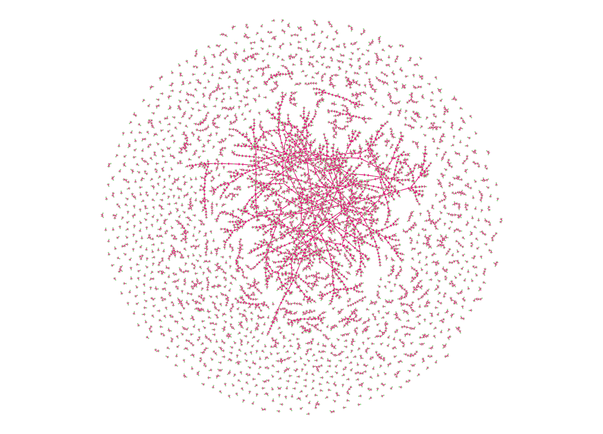
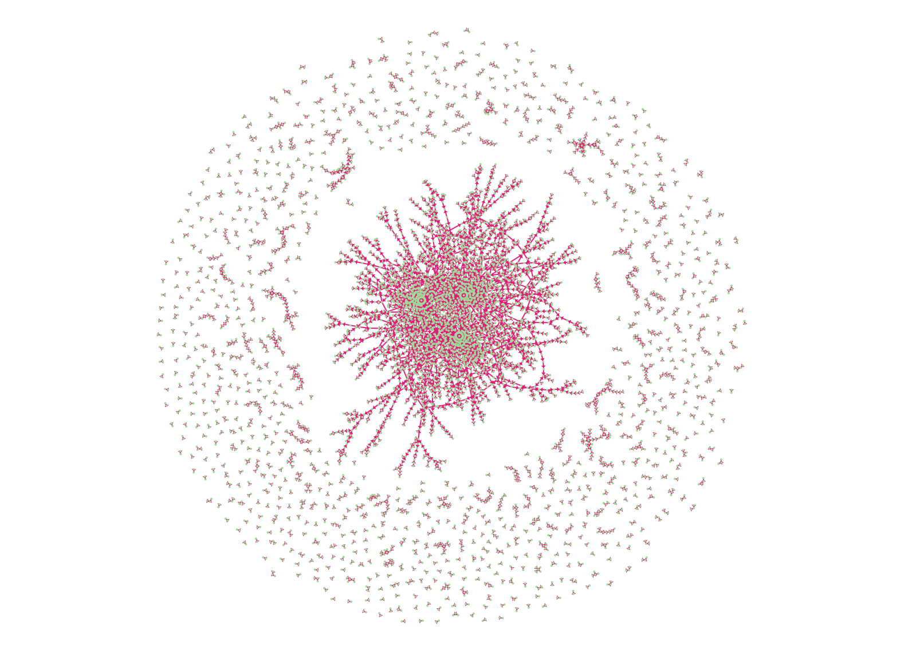
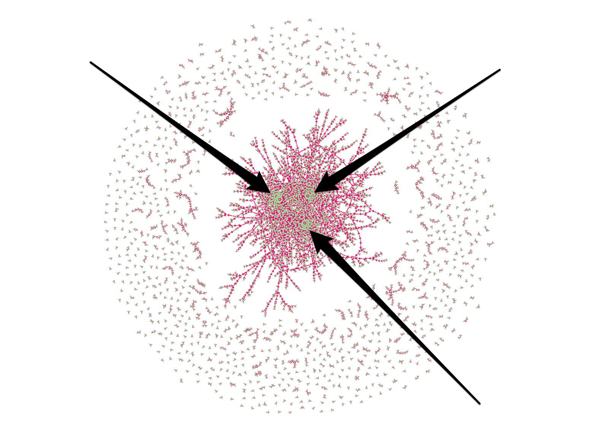

# Spark GraphX

In this lab, you will take your first steps using Spark's graph processing library, GraphX, specifically, using the PageRank algorithm on data comprised of financial transfers.

## Objectives

1. Open and interact with Spark via Spark's interactive shell.
2. Use the GraphX library to perform a PageRank scoring of financial transfer data.

## Prerequisites

This lab assumes that the student is familiar with the course environment, in particular, the Spark distribution.

## Instructions

### Open the Spark shell

First, we need to open the Spark shell.  Simply change directory to your Spark home and issue the command  `bin/spark-shell` command:

``` sh
$ cd $SPARK_HOME
$ bin/spark-shell --master local[*]
```

Next, you'll see output like the following.  Don't worry if the versions of things shown below don't *exactly* match what you have on your machine, and you may have more or less logging than what's shown.

``` scala
log4j:WARN No appenders could be found for logger (org.apache.hadoop.metrics2.lib.MutableMetricsFactory).
log4j:WARN Please initialize the log4j system properly.
log4j:WARN See http://logging.apache.org/log4j/1.2/faq.html#noconfig for more info.
Using Spark's repl log4j profile: org/apache/spark/log4j-defaults-repl.properties
To adjust logging level use sc.setLogLevel("INFO")
Welcome to
      ____              __
     / __/__  ___ _____/ /__
    _\ \/ _ \/ _ `/ __/  '_/
   /___/ .__/\_,_/_/ /_/\_\   version 1.5.2
      /_/

Using Scala version 2.10.4 (Java HotSpot(TM) 64-Bit Server VM, Java 1.8.0_31)
Type in expressions to have them evaluated.
Type :help for more information.
15/12/18 15:10:18 WARN MetricsSystem: Using default name DAGScheduler for source because spark.app.id is not set.
Spark context available as sc.
SQL context available as sqlContext.

scala>
```

Awesome — we're now ready to do some graph processing!

### Overview

In this lab, we're going to pretend that we're working in a ficticious company that provides the ability to transfer funds among its members.  Our business intelligence department wants us to identify customers who

* are bringing money into their account so that we can reward them because we make money on the interest while they have money in their account,
* are transferring money out of their account so that we can incentivize them to keep money in their account,
* are using the platform a lot so we can learn more about them to guide new feature development, and
* are deemed important, power users of the platform by virtue of their transfer activity.

It sounds like a lot, but thanks to Spark's GraphX API, we can answer these questions quite easily.

Our data is very simple:  each account is identified by a 4-digit account number from 1000-9999, and we simply have a record over some time period of transfers among those accounts in the form

``` 
sourceAccount,destinationAccount,amount
```

This data naturally forms a directed multigraph that allows us to answer the questions that our BI department is asking.

### Read transfer data

The first thing we need to do is to read our transfer data, which will provide the basis of our graph.  Here's a small sample of the transfer data:

``` 
5692,2555,289.32
8691,8476,341.76
6683,1083,76.54
5202,1690,283.05
5449,4779,741.42
...
```

The first column identifies the source account, the second, the destination account, and the third, the amount of money transferred which we've constrained to between $1.00 and $1,000.00 for this lab.  There are about half a million transfers in our sample data set, far too many for manual analysis.

Let's read this data into your Spark shell with the following commands:

``` 
import org.apache.spark._
import org.apache.spark.rdd.RDD
import org.apache.spark.graphx._
import scala.math._

case class Transfer(src:Long,dst:Long,amount:Double)

val tx = sc.textFile(srcDir + "/txfr.csv").distinct.map(_.split(",")).map(x => Transfer(x(0).toLong,x(1).toLong,x(2).toDouble)).cache
println("Tx count: " + tx.count)
```

First, we're importing stuff we'll need.  Next, we're defining a `Transfer` class to make interacting with our data a little easier.  Lastly, we're importing the data from the source file `tx.csv` in the lab directory, calling `distinct` on the source lines just to ensure we don't have any duplicates (our source system was imperfect), parsing the rows into `Transfer` objects, then caching the `RDD` in memory (and then printing the count of transactions just for good measure).

Ok, now we're ready to graphify this data!

### Identify vertices

The two things we'll need to identify in our source data are first, the vertices (also called "nodes"), and second, the edges, of our graph.  In this dataset, our vertices will consist of the accounts.  Before we can create the vertices, we need to get the distinct accounts that are present in the source data.

``` scala
val accts = tx.flatMap(x => Array(x.src,x.dst)).distinct
```

Here, we're simply `flatMap`ing an array of the source and destination accounts of each transfer, then removing duplicates with `distinct`.  Easy-peasy.  Now, let's turn these into vertices:

``` scala
val vertices = accts.map(x => (x, x))
```

Huh?  Why are we mapping each account number to a tuple of the account number and itself?  The answer is pretty simple:  each vertex is identifed by a `VertexId` (which is a type alias for a `Long`), and the vertex's property type `VD`.  In this case, we're going to use the account number for both the `VertexId` and its property type, `VD`.  That means the type of `vertices` is then `RDD[(Long,Long)]`:  an `RDD` of a tuple of `Long` & `Long`.  Since `Long` is type-aliased to `VertexId`, `vertices` also can be thought of as `RDD[VertexId,Long]`.

Let's set `vertices` aside for a moment and move on to the edges of our graph.

### Identify edges

Just as a vertex has a property type, so does an `Edge`.  `Edge`s connect two vertices together, so they naturally have a source vertex & and destination vertex, however, instead of holding references to actual vertices, the `Edge` holds the source & destination `VertexId`.  `Edge`s also have a property, denoted as `ED`.  Naturally, then, an `Edge`, which is a `case class`, has a constructor of type `Edge[ED](src: VertexId, dst: VertexId, property: ED)`.  Let's use this to build edges from our transaction data, `tx`:

``` 
val edges = tx.map(x => Edge(x.src, x.dst, x.amount))
```

For our data, then, each edge is of type `Edge[Double]` (remember that `Transaction.src` & `Transaction.dst` are both `Long`, which is the same as `VertexId`).

Now that we've defined both our vertices and our edges, let's define the graph.

### Construct the graph

Spark GraphX's type for a graph is `org.apache.spark.graphx.Graph[VD, ED]`, where `VD` is the property type of its vertices and `ED` is the property type of its edges.  To construct one, simply use the `Graph` companion object's `apply` method, which, in its simplest form, is `apply[VD, ED](vertices: RDD[(VertexId, VD)], edges: RDD[Edge[ED]])`.  Let's do that now with our data:

``` scala
val graph = Graph(vertices, edges)
```

So simple is almost anticlimactic, right?  Now that we've got our graph instantiated, let's take a moment to visualize a small subset of it (see file `viz.scala` in this lab's solution directory if you're curious as to how this image was created):



As you can see, it's pretty random, which makes sense, since a random number generator was used to produce it.  Even for a human, it's pretty much impossible to identify anything that would lead us to answers to our BI department's questions.  What a mess, much like real life!

### Query over the graph

It turns out we can answer the first three BI questions by querying over the graph.  The first question, which is basically "Who is receiving the most transfers?", can be answered by counting up all the `Edge`s pointing to each vertex — this is also called the "degrees" of the vertex, and there are two kinds:  inward pointing `Edge`s (from other vertices to "this" one), and outward pointing `Edge`s (from "this" one to other vertices).  GraphX provides us with three methods for these:  `degrees`, `inDegrees`, and `outDegrees`, respectively.  Let's use them to answer the three questions:

``` scala
val top5in = graph.inDegrees.sortBy(_._2, ascending = false).take(5)
println("Top 5 receivers:")
top5in.foreach(println(_))
```

Here, `inDegrees` is returning to us a `VertexRDD[Int]`, which is the same as `RDD[(VertexId,Int)]`.  This means that we can simply sort in `inDegrees` by the number of inbound edges in descending order, then take whatever we want (5 in this case).  You should see the following results in your console:

``` 
Top 5 receivers:
(6548,93)
(3262,84)
(6668,84)
(1819,83)
(1545,82)
```

Ok, plug & chug now:

``` scala
val top5out = graph.outDegrees.sortBy(_._2, ascending = false).take(5)
println("Top 5 senders:")
top5out.foreach(println(_))
```

Our top 5 accounts with outbound transfers are:

``` 
Top 5 senders:
(9374,96)
(2347,89)
(7599,84)
(7720,82)
(3818,82)
```

Now, for the most active users:

``` scala
val top5inout = graph.degrees.sortBy(_._2, false).take(5)
println("Top 5 most active:")
top5inout.foreach(println(_))
```

Your output should be:

``` 
Top 5 most active:
(9374,158)
(2260,154)
(2347,152)
(8056,147)
(2293,147)
```

Ok, so we were able to do simply graph queries to find out some useful information for our BI folks, but what about the million dollar question?  BI wants to know who are the *most important* users of our platform.  How can we answer that?

### Use PageRank

If you read section titles, which are hard to ignore, you might have guessed it already:  the PageRank algorithm, popularized (and monetized *ad nauseum*) by Google.  This algorithm attempts to identify which vertices in a graph are "important" by looking at which ones are pointed to the most, and which vertices those important ones point to.  If an important node points to another node, then that node's importance goes up, and so on.  Let's use it now to find out who our most important users are:

``` scala
val ranks = graph.pageRank(0.0001).vertices
println("Top 5 by PageRank:")
ranks.sortBy(_._2, ascending = false).take(5).foreach(println(_))
```

Here, we're called `pageRank` and giving it a threshold of 0.0001, meaning once changes in scores reach less than 0.0001, the algorithm declares itself finished.  We then take the vertices from the resulting `Graph[Double,Double]`, which represent the rankings of the vertices.  From there, it's a simple descending sort on the scores (the second element in the tuple) and take however many we want:

``` 
Top 5 by PageRank:
(6548,1.5275903676850071)
(1819,1.4392690890150412)
(8267,1.423544071380168)
(6668,1.4226370659662904)
(3262,1.4200988374573378)
```

Well, there you have it!  Our top 5 *most important* accounts, as determined by PageRank!  Now, you have no choice but to believe it on faith, since we don't know this transfer data at all.  What if we could bias our data to see if our artificial anomalies produce data that we know we can believe (or at least lets us know that we're not crazy)?

### Bias the data

Well, we've done that for you!  We added 50,000 transactions that are *intentionally* biased, so that accounts `1111`, `2222` & `3333` receive many more transfers than any of the others.  This data is contained in lab file `txfr-with-bias.csv`.

Let's visualize (a small subset of) the data, to prove to ourselves that it's biased:



Notice the three clumps in the middle?  Here, let me show you:



The arrows above indicate the rough location of accounts 1111, 2222 & 3333 in our biased graph.

Now, repeat the steps above with that file, or just execute the following commands in your shell:

``` scala
val tx2 = sc.textFile(srcDir + "/txfr-with-bias.csv").distinct.map(_.split(",")).map(x => Transfer(x(0).toLong,x(1).toLong,x(2).toDouble)).cache
println("Tx2 count: " + tx2.count)
val accts2 = tx2.flatMap(x => Array(x.src,x.dst)).distinct
val vertices2 = accts2.map(x => (x, x))
val edges2 = tx2.filter(_.amount > 100).map(x => Edge(x.src, x.dst, x.amount))

val graph2 = Graph(vertices2, edges2)

val top5in2 = graph2.inDegrees.sortBy(_._2, false).take(5)
println("Top 5 receivers:")
top5in2.foreach(println(_))

val top5out2 = graph2.outDegrees.sortBy(_._2, false).take(5)
println("Top 5 senders:")
top5out2.foreach(println(_))

val top5inout2 = graph2.degrees.sortBy(_._2, false).take(5)
println("Top 5 most active:")
top5inout2.foreach(println(_))

val ranks2 = graph2.pageRank(0.0001).vertices
println("Top 5 by PageRank:")
ranks2.sortBy(_._2, ascending = false).take(5).foreach(println(_))
```

Your output should look like the following:

``` 
...
Top 5 receivers:
(3333,11345)
(2222,11288)
(1111,11266)
(6548,83)
(6668,82)
...
Top 5 senders:
(9374,93)
(2830,84)
(7282,83)
(3818,82)
(8056,82)
...
Top 5 most active:
(3333,11390)
(2222,11341)
(1111,11317)
(9374,152)
(8056,145)
...
Top 5 by PageRank:
(1111,181.9586873478817)
(2222,175.5147817695734)
(3333,166.43821561922303)
(6548,4.339411223904872)
(1048,4.216978017665352)
```

This makes sense.  Since we've biased our data toward transfers into accounts 1111, 2222 & 3333, it makes sense that their importance goes up, because importance is determined, according to PageRank, in part by how many vertices point toward another vertex.  The more vertices that point toward a vertex, the more important that vertex is scored.

## Conclusion

We saw in this lab how we can create graphs of data and perform fairly simply calculations over them to answer questions that could have great business value.  We also saw how we can use more sophisticated graph analytics like PageRank to glean even more information from a graph.