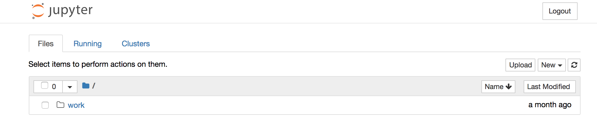

# Running Notebooks

## Introduction

One of the options for running the labs is to use [Jupyter notebooks](http://jupyter.org/).

If you are not familiar with Jupyter Notebooks, Jupyter is an  open-source software that allows us to combine markdown text with code segments for an interactive computing experience across dozens of programming languages.

You have a couple of options for running Jupyter, but our preferred way is to use Docker.

## Prerequisites

To run Jupyter, you'll have to have Docker installed. If you don't have Docker installed, you can find out how at this site: https://www.docker.com/.

## Run the notebooks

We will map the resource directory of the labs to an accessible directory inside the docker container. The instruction below assumes that you are in the root directory where you have all the course material (you should see a set of subdirectories called `lesson-5XX...`).

To run the notebooks, simply run the following command (on Mac or Unix, if you are on Windows, you may have to change the `${PWD}` to the full path of your directory):

```sh
docker run -it --rm -p 8888:8888 -v ${PWD}/lesson-5xx-resources:/home/jovyan/Resources -e SPARK_OPTS='--driver-memory 4g' jupyter/all-spark-notebook
```

Let's go through some of the parameters for your future reference and possible configuration changes for later:

* `docker run`
  * This is simply command for running the docker container.
* `-it`
  * This is a combination of two options `-i` and `-t`
  * `-i` means to keep STDIN open even if not attached. This is necessary so that we can interact with the docker image (e.g., hit `Control-C` to kill the image)
  * `-t` means to allocate a pseudo-tty that allows us to see the output from the docker container.
* `--rm`
  * Cleans up the containers state when the container dies. This option you may want to omit as it will clear out any work you've done when running the container, but for the course, you can always reimport the workbooks we're using and it makes it less likely that you'll get into an irrecoverable state.
* `-p 8888:8888`
  * This is a portmapping that makes the container expose the port 8888 to the host machine on port 8888. This is required so that we can access the container with a web-browser.
* `-e SPARK_OPTS='--driver-memory 4g'`
  * This sets the memory used by the Spark driver to 4 GB. You may want to adjust this parameter to more or less memory based on your machine configuration.
* `jupyter/all-spark-notebook`
  * Finally we have the name of the image that we will use to create the container.

After the Jupyter Docker Image has been downloaded, it will start up and you'll see something similar to the text below:

```shell
[I 01:03:54.942 NotebookApp] The Jupyter Notebook is running at:
[I 01:03:54.943 NotebookApp] http://[all ip addresses on your system]:8888/?token=ab2dd1b7619a137ceabe89501475952e2373124e65292918
[I 01:03:54.943 NotebookApp] Use Control-C to stop this server and shut down all kernels (twice to skip confirmation).
[C 01:03:54.944 NotebookApp]

    Copy/paste this URL into your browser when you connect for the first time,
    to login with a token:
        http://localhost:8888/?token=ab2dd1b7619a137ceabe89501475952e2373124e65292918

```

Copy and paste the URL presented into a browser and you should see something similar to this:



## Congratulations!

You now have a Jupyter Notebook with a supported Spark Computation machine and support for Python and Scala!
